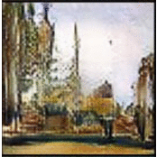

# ArtGAN/Improved ArtGAN

Updated on August 18, 2018 (Improved ArtGan models are included)

Released on May 20, 2018.

# Description

This is implementation of our TIP-19 work with titled [Improved ArtGAN for Conditional Synthesis of Natural Image and Artwork](https://arxiv.org/abs/1708.09533). The preliminary version of this work was presented earlier in ICIP-17 with titled [ArtGAN: Artwork Synthesis with Conditional Categorial GANs](https://arxiv.org/abs/1702.03410). 

The details of the model settings and training scheme can be found at [this PDF](http://cs-chan.com/doc/ArtGAN_supp.pdf).



# Citation
This repository contains codes for the following paper:

```
@article{artgan2018,
  title={Improved ArtGAN for Conditional Synthesis of Natural Image and Artwork},
  author={Tan, Wei Ren and Chan, Chee Seng and Aguirre, Hernan and Tanaka, Kiyoshi},
  journal={IEEE Transactions on Image Processing},
  volume    = {28},
  number    = {1},
  pages     = {394--409},
  year      = {2019},
  url       = {https://doi.org/10.1109/TIP.2018.2866698},
  doi       = {10.1109/TIP.2018.2866698}
}
```
which is an extension to the following paper (ICIP 2017): 
```
@inproceedings{TanCAT17,
  author    = {Tan, Wei Ren and Chan, Chee Seng and Aguirre, Hernan and Tanaka, Kiyoshi},
  title     = {ArtGAN: Artwork synthesis with conditional categorical GANs},
  booktitle = {{IEEE} International Conference on Image Processing {ICIP}},
  pages     = {3760--3764},
  year      = {2017},
  doi       = {10.1109/ICIP.2017.8296985},
}
```

# Prerequisites
- Python 2.7
- [Tensorflow](https://github.com/tensorflow/tensorflow.git)
- (Optional) [Nervana's Systems neon](https://github.com/NervanaSystems/neon.git)
- (Optional) [Nervana's Systems aeon](https://github.com/NervanaSystems/aeon.git)

\* Neon and aeon are required to load data. If other data loader is used, neon and aeon are not required. But, make sure that data format is 'NCHW'.

# Trained models

Each link below is the best trained model used in the T-IP paper for the corresponding dataset. Download and extract to "models" folder:

- CIFAR-10 - available at [this https URL](https://drive.google.com/file/d/1fjBUxRDUrKF2aP44hpuOHEWTiZ0nb0or/view?usp=sharing)

- STL-10 - available at [this https URL](https://drive.google.com/file/d/1FlOrjEtMJ7bPJ1phg6SXRpie4VIgHv_x/view?usp=sharing)

- Flowers - available at [this https URL](https://drive.google.com/file/d/13Xo9uPuB8CK0FJPmn3xJ4HX6zNk_dbW1/view?usp=sharing)

- CUB-200 - available at [this https URL](https://drive.google.com/file/d/1S7vlMKXcMF0_DvB1jJ7OPVpKSjDJhPcY/view?usp=sharing)

- Wikiart Artist - available at [this https URL](https://drive.google.com/file/d/1Di088ALhqlBwTQOzYdQCmo7XWSCUhf_n/view?usp=sharing)

- Wikiart Genre - available at [this https URL](https://drive.google.com/file/d/1vnkKjAUbbPuAxZNjhj48Sr8GhG1cZBDZ/view?usp=sharing)

- Wikiart Style - available at [this https URL](https://drive.google.com/file/d/1PL9zC9i9Cww8sD2uq00el1fz5HjeTlaP/view?usp=sharing)

# Feedback
Suggestions and opinions of this work (both positive and negative) are greatly welcome. Please contact the authors by sending email to Wei Ren Tan at `wrtan.edu at gmail.com` or Chee Seng Chan at `cs.chan at um.edu.my`

# License
BSD-3, see LICENSE file for details.
